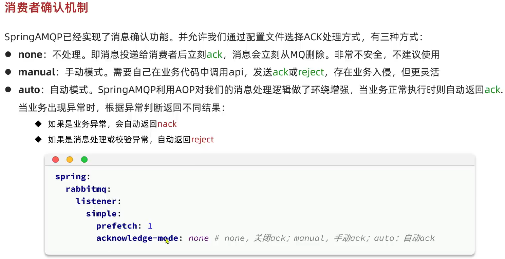

# RabbitMQ

## work模型

保证消息按照消费者的处理能力被分配

## fanout交换机

## direct交换机

## topic交换机

## 代码自动生成队列和交换机

### 第一种方式

### 第二种方式

## 消息转换器

可以减小消息占用的空间，防止jdk反序列化的漏洞

## 消息可靠性

### 生产者重连

### 生产者确认

#### 回调函数

### lazy queue

### 消费者确认

### 消费失败重试

## 幂等性

## 延迟消息

### 死信

### 延迟插件

