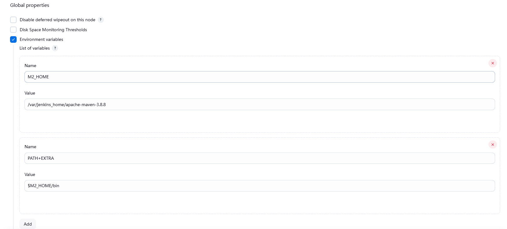

# jenkins

## pipline

### 前端

```groovy
pipeline {
    agent any

    stages {
        stage('Checkout') {
            steps {
                echo 'Building...'
               git url: 'git@codeup.aliyun.com:6553648e7704ab4fe7cadf20/sqi-frontend.git', branch: 'master'
            }
        }

        stage('Build') {
            steps {
                // 在这里添加构建步骤，例如使用 Maven、Gradle、npm 等。
                echo "Current workspace: ${env.WORKSPACE} Building..."
                // 运行前端打包命令
                sh 'npm config get registry'
                sh 'npm install'
                sh 'npm run build'
            }
        }
        stage('Deploy to Nginx') {
            steps {
                echo "Current workspace: ${env.WORKSPACE} Deploying to Nginx..."
                 script {
                    // 假设构建好的代码在 ./dist 目录中
                    // 使用 scp 传输文件，确保 Jenkins 容器可以访问 Nginx 容器的 IP 和 SSH 端口
                    sh '''
                    scp -r ./dist/* root@deploy-nginx:/usr/share/nginx/html/
                    ssh root@deploy-nginx "nginx -s reload" 
                    ''' // 重新加载 Nginx 配置
                    // 替换 user 和 nginx_ip 为实际的 SSH 用户名和 Nginx 容器 IP
                }
            }
        }

    }

    post {
        success {
            echo 'Pipeline completed successfully!'
        }
        
        failure {
            echo 'Pipeline failed.'
        }

        always {
        script {
            mail to: 'abcde228866@126.com', // 邮件收件人
                subject: "Running Pipeline: ${currentBuild.fullDisplayName}", // 邮件主题
                body: """SUCCESSFUL: Job '${env.JOB_NAME} [${env.BUILD_NUMBER}]'

                项目名称: ${env.JOB_NAME}
                构建次数: ${env.BUILD_NUMBER}
                构件编号: ${BUILD_NUMBER}
                工作目录: ${env.WORKSPACE}
                构建URL: ${env.BUILD_URL}
                构建日志: ${BUILD_URL}console
                """ // 邮件正文内容
        }
    }
    }
}
```
### 后端

```groovy
pipeline {
    agent any

    stages {
        stage('Checkout') {
            steps {
                echo 'Building...'
                git url: 'git@codeup.aliyun.com:6553648e7704ab4fe7cadf20/sqi-backend.git', branch: 'chz'
            }
        }

        stage('Build') {
            steps {
                // 在这里添加构建步骤，例如使用 Maven、Gradle、npm 等。
                echo "Current workspace: ${env.WORKSPACE} Building..."
                // 运行前端打包命令
                sh 'mvn -version'
                sh 'mvn clean'
                sh 'mvn package'
            }
        }
        stage('Deploy to jdk8') {
            steps {
                echo "Current workspace: ${env.WORKSPACE} Deploying to Nginx..."
                script {
                    // 假设构建好的代码在 ./dist 目录中
                    // 使用 scp 传输文件，确保 Jenkins 容器可以访问 Nginx 容器的 IP 和 SSH 端口
                    sh '''
                    scp -r ./target/sqi-0.0.1-SNAPSHOT.jar root@deploy-jdk8:/
                    ssh root@deploy-jdk8 "nohup java -jar /sqi-0.0.1-SNAPSHOT.jar > output.log 2>&1 &"
                    ''' // 重新加载 Nginx 配置
                    // 替换 user 和 nginx_ip 为实际的 SSH 用户名和 Nginx 容器 IP
                }
            }
        }

    }

    post {
        success {
            echo 'Pipeline completed successfully!'
        }

        failure {
            echo 'Pipeline failed.'
        }

        always {
            script {
                mail to: 'abcde228866@126.com', // 邮件收件人
                        subject: "Running Pipeline: ${currentBuild.fullDisplayName}", // 邮件主题
                        body: """SUCCESSFUL: Job '${env.JOB_NAME} [${env.BUILD_NUMBER}]'

                项目名称: ${env.JOB_NAME}
                构建次数: ${env.BUILD_NUMBER}
                构件编号: ${BUILD_NUMBER}
                工作目录: ${env.WORKSPACE}
                构建URL: ${env.BUILD_URL}
                构建日志: ${BUILD_URL}console
                """ // 邮件正文内容
            }
        }
    }
}
```


## maven和npm

> npm config set registry https://registry.npmmirror.com
>
> 安装maven
>
> 配置环境变量
>
> export MAVEN_HOME=/var/jenkins_home/apache-maven-3.8.8
>
> export PATH=$PATH:$MAVEN_HOME/bin
>
> system->global properties




# ssh

**错误**

> root@7914b2247ce1:/var/jenkins_home/workspace/personnel# scp  -r ./dist/* root@deploy-nginx:/usr/share/nginx/html/
> scp: Received message too long 1400136050
> scp: Ensure the remote shell produces no output for non-interactive sessions.

**解决**

修改sftp服务为内部的sftp。

> vim /etc/ssh/sshd_config
> 注释掉Subsystem sftp  /usr/libexec/openssh/sftp-server
> 新增一行 Subsystem sftp internal-sftp , 表示使用内部sftp
> (修改后, 即便Shell启动文件中有输出语句，也不再影响sftp的使用)
>
> service ssh restart

**错误**

> root@7914b2247ce1:/# ssh root@deploy-jdk8 "bash -l -c 'java -jar /sqi-0.0.1-SNAPSHOT.jar'"
> bash: java: command not found

**解决**

> 编辑/root/.bashrc
>
> export JAVA_HOME=/opt/java/openjdk    要写在[ -z "$PS1" ] && return前面
>
> export PATH=$JAVA_HOME/bin:$PATH
>
> source /root/.bashrc
