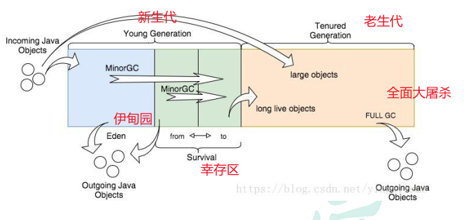

# jvm调优

## 常用参数

```java
//调整内存大小
-XX:MetaspaceSize=128m（元空间默认大小）
-XX:MaxMetaspaceSize=128m（元空间最大大小）
-Xms1024m（堆最大大小）
-Xmx1024m（堆默认大小）
-Xmn256m（新生代大小）
-Xss256k（栈最大深度大小）
 
//调整内存比例
 //伊甸园:幸存区
-XX:SurvivorRatio=8（伊甸园:幸存区=8:2）
 //新生代和老年代的占比
 -XX:NewRatio=4  //表示新生代:老年代 = 1:4 即老年代占整个堆的4/5；默认值=2
 
//修改垃圾回收器
//设置Serial垃圾收集器（新生代）
//-XX:+UseSerialGC
 //设置PS+PO,新生代使用功能Parallel Scavenge 老年代将会使用Parallel Old收集器
//-XX:+UseParallelOldGC
 //CMS垃圾收集器（老年代）
//-XX:+UseConcMarkSweepGC
 //设置G1垃圾收集器
-XX:+UseG1GC
 
//GC停顿时间，垃圾收集器会尝试用各种手段达到这个时间
 -XX:MaxGCPauseMillis
 
 //进入老年代最小的GC年龄,年轻代对象转换为老年代对象最小年龄值，JDK8默认值15，JDK9默认值7
 -XX:InitialTenuringThreshold=7
 //新生代可容纳的最大对象,大于则直接会分配到老年代，0代表没有限制。
  -XX:PretenureSizeThreshold=1000000
 
 //使用多少比例的老年代后开始CMS收集，默认是68%，如果频繁发生SerialOld卡顿，应该调小
 -XX:CMSInitiatingOccupancyFraction 
 //G1混合垃圾回收周期中要包括的旧区域设置占用率阈值。默认占用率为 65%
 -XX:G1MixedGCLiveThresholdPercent=65
 
 //Heap Dump（堆转储）文件
 //当发生OutOfMemoryError错误时，自动生成堆转储文件。
-XX:+HeapDumpOnOutOfMemoryError 
 //错误输出地址
-XX:HeapDumpPath=/Users/a123/IdeaProjects/java-test/logs/dump.hprof
 
 //GC日志
-XX:+PrintGCDetails（打印详细GC日志）
-XX:+PrintGCTimeStamps：打印GC时间戳（以基准时间的形式）
-XX:+PrintGCDateStamps：打印GC时间戳（以日期格式）
-Xlog:gc:（打印gc日志地址）
```

## 一次完整的GC流程

1. 首先，任何新对象都分配到 eden 空间。两个幸存者空间开始时都是空的。
2. 当 eden 空间填满时，将触发一个Minor GC(年轻代的垃圾回收，也称为Young GC)，删除所有未引用的对象，大对象（需要大量连续内存空间的Java对象，如那种很长的字符串）直接进入老年代。
3. 所有被引用的对象作为存活对象，将移动到第一个幸存者空间S0，并标记年龄为1，即经历过一次Minor GC。之后每经过一次Minor GC，年龄+1。GC分代年龄存储在对象头的Mark Word里。
4. 当 eden 空间再次被填满时，会执行第二次Minor GC，将Eden和S0区中所有垃圾对象清除，并将存活对象复制到S1并年龄加1，此时S0变为空。
5. 如此反复在S0和S1之间切换几次之后，还存活的年龄等于15的对象（JDK8默认15，JDK9默认7，-XX:InitialTenuringThreshold=7）在下一次Minor GC时将放到老年代中。 
6. 当老年代满了时会触发Major GC（也称为Full GC），Major GC 清理整个堆 – 包括年轻代和老年代。



## 调整大对象阈值

Young GC时大对象会不顾年龄直接移动到老年代。当Full GC频繁时，我们关闭或提高大对象阈值，让老年代更迟填满。

默认是0，即大对象不会直接在YGC时移到老年代。

```java
 //新生代可容纳的最大对象,大于则直接会分配到老年代，0代表没有限制。
  -XX:PretenureSizeThreshold=1000000
```

## 调整GC的触发条件

### CMS调整老年代触发回收比例

CMS的[并发](https://marketing.csdn.net/p/3127db09a98e0723b83b2914d9256174?pId=2782&utm_source=glcblog&spm=1001.2101.3001.7020)标记和并发清除阶段是用户线程和回收线程并发执行，如果老年代满了再回收会导致用户线程被强制暂停。所以我们修改回收条件为老年代的60%，保证回收时预留足够空间放新对象。CMS默认是老年代68%时触发回收机制。

```java
 //使用多少比例的老年代后开始CMS收集，默认是68%，如果频繁发生SerialOld卡顿，应该调小
 -XX:CMSInitiatingOccupancyFraction
```

### G1调整存活阈值

超过存活阈值的Region，其内对象会被混合回收到老年代。G1回收时也要预留空间给新对象。存活阈值默认85%，即当一个内存区块中存活对象所占比例超过 85% 时，这些对象就会通过 Mixed GC 内存整理并晋升至老年代内存区域。

```java
 //G1混合垃圾回收周期中要包括的旧区域设置占用率阈值。默认占用率为 65%
 -XX:G1MixedGCLiveThresholdPercent=65
```

## 选择合适的垃圾回收器
JVM调优最实用、最有效的方式是升级垃圾回收器，根据CPU核数，升级当前版本支持的最新回收器。

- CPU单核，那么毫无疑问Serial 垃圾收集器是你唯一的选择。
- CPU多核，关注吞吐量 ，那么选择Parallel Scavenge+Parallel Old组合（JDK8默认）。
- CPU多核，关注用户停顿时间，JDK版本1.6或者1.7，那么选择ParNew+CMS，吞吐量降低但是低停顿。
- CPU多核，关注用户停顿时间，JDK1.8及以上，JVM可用内存6G以上，那么选择G1

设置PS+PO,新生代使用功能Parallel Scavenge 老年代将会使用Parallel Old收集器 

```java
//修改垃圾回收器
 //设置PS+PO,新生代使用功能Parallel Scavenge 老年代将会使用Parallel Old收集器
-XX:+UseParallelOldGC

```

设置CMS垃圾收集器（老年代）

```java
//CMS垃圾收集器（老年代）
-XX:+UseConcMarkSweepGC
```

设置G1垃圾收集器 

```java
//修改垃圾回收器
 //设置G1垃圾收集器
-XX:+UseG1GC
```

## GC调优
**GC频率的合理范围**
jvm.gc.time：每分钟的GC耗时在1s以内，500ms以内尤佳

jvm.gc.meantime：每次YGC耗时在100ms以内，50ms以内尤佳

jvm.fullgc.count：最多几小时FGC一次，1天不到1次尤佳

jvm.fullgc.time：每次FGC耗时在1s以内，500ms以内尤佳

最差情况下能接受的GC频率：Young GC频率10s一次，每次500ms以内。Full GC频率10min一次，每次1s以内。

其实一小时一次Full GC已经算频繁了，一个不错的应用起码得控制一天一次Full GC。

## 调整线程池参数
合理设置线程池的线程数量。

下面的参数只是一个预估值，适合初步设置，具体的线程数需要经过压测确定，压榨（更好的利用）CPU的性能。

**记CPU核心数为N**

**核心线程数：**

- CPU密集型：N+1。数量与CPU核数相近是为了不浪费CPU，并防止频繁的上下文切换，加1是为了有线程被阻塞后还能不浪费CPU的算力。

- I/O密集型：2N，或N/(1-阻塞系数)。I/O密集型任务CPU使用率并不是很高，可以让CPU在等待I/O操作的时去处理别的任务，充分利用CPU，所以数量就比CPU核心数高一倍。有些公司会考虑阻塞系数，阻塞系数是任务线程被阻塞的比例，一般是0.8~0.9。

实际开发中更适合的公式：N*((线程等待时间+线程计算时间)/线程计算时间)
最大线程数：设成核心线程数的2-4倍。数量主要由CPU和IO的密集性、处理的数据量等因素决定。