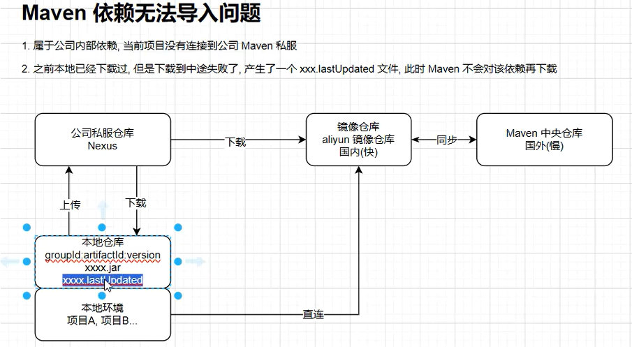

# maven

```xml
	<resources>
            <resource>
                <directory>src/main/resources</directory>
                <filtering>false</filtering>   true时maven会解析资源文件，将占位符填充为实际值，但是如果资源文件中有二
                <includes>                     进制文件就会报错
                    <!--<include>application.yml</include>-->
                    <!--<include>application-${package.environment}.yml</include>-->
                    <!--<include>**/*.xml</include>-->
                    <include>**/*</include>
                </includes>
            </resource>
        </resources> 
```

## 依赖导入问题


