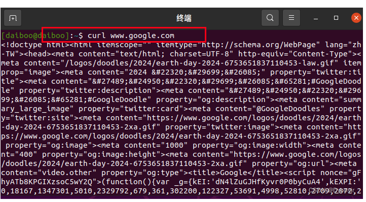

# 虚拟机使用宿主机vpn

前面这些配虚拟机网络地址的步骤可以用默认的配置，然后检查宿主机的vm适配器ip和vm的是否一致，是ping检查是否能ping通适配器1，适配器8是ping不通的，虚拟机里也检查是否能ping 适配器1，配置完重启虚拟机

1.VM虚拟网络编辑器
打开虚拟网络编辑器（方式：编辑->虚拟网络编辑器),


然后点击更改设置


2.配置VMnet8和VMnet1
VMnet8【子网配置】如下：


【NAT设置】如下：


【DHCP设置】如下：（可以理解为虚拟机的ip范围， 不要跟上图配置的网关冲突了）


【VMnet1】采用默认配置就可以了：


四、主机IP配置
windows进入打开设置->网络

【2024-9-18补充】【可选START  // 表示这个范围是可有可无的】


双击上述红框，然后配置如下：（这里不要跟之前的网关冲突了）


【2024-9-18补充】【可选END   // 表示这个范围是可有可无的】

代理软件要开启【Allow LAN】：（这里要记住端口, 我的是7890）


然击后点：


记住下面的接口ip,这个ip需要在Vm虚拟机中使用， 两个都可以用


在windows终端下输入ipconfig同样可以查到：


五、虚拟机代理ip配置
在配置代理之前需要设置网络适配器， 我们之前配置了VMnet8，在这里可以使用。


5.1 虚拟机上用【设置】配置代理
用【设置】配置代理，代理设置会影响所有图形app， 比如浏览器，shell..

但是却影响不了ssh(用ssh连接虚拟机ubuntu)终端，所以在使用ssh还需要配置代理，参考第七节。

当然这种配置也影响不了很多需要单独配置代理的app, 比如conda, pip, docker等等

进入虚拟机，配置ip,如果是Ubuntu可以参考下面的配置：(注意下图的端口，要跟代理软件的端口一致)


然后可以打开浏览器看外网，或者终端：



七、关于ssh代理配置，终端使用代理
ssh连接

1. vscode proxy配置
这样就可以使用一些需要代理的插件，比如copilot


2. ssh远程终端使用代理
在~/.bashrc中添加代理配置:

# 代理
```bash
export hostip=192.168.80.1
export post=7890
alias proxy='
	export http_proxy=http://${hostip}:${post}
	export https_proxy=http://${hostip}:${post}
	export ALL_PROXY=http://${hostip}:${post}
	export all_proxy=socks://${hostip}:${post}
'
alias unproxy='
    unset ALL_PROXY
    unset https_proxy
    unset http_proxy
    unset all_proxy
'
alias echoproxy='
    echo $ALL_PROXY
    echo $all_proxy
    echo $https_proxy
    echo $http_proxy
'

```

source  ~/.bashrc

想要使用代理了，终端输入proxy,取消unproxy。

