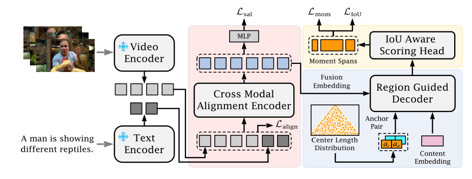
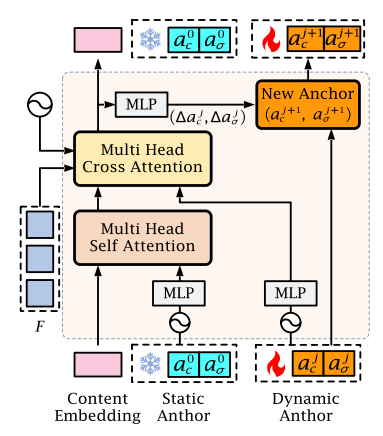
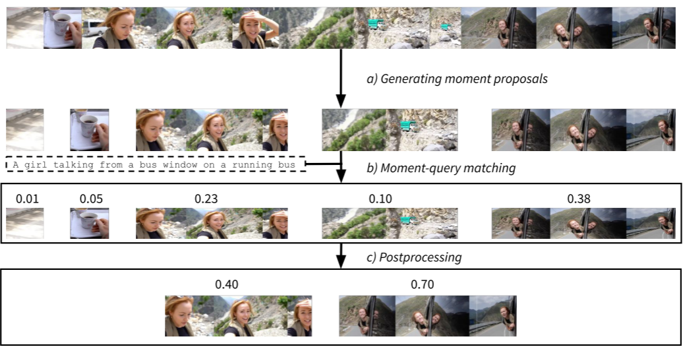
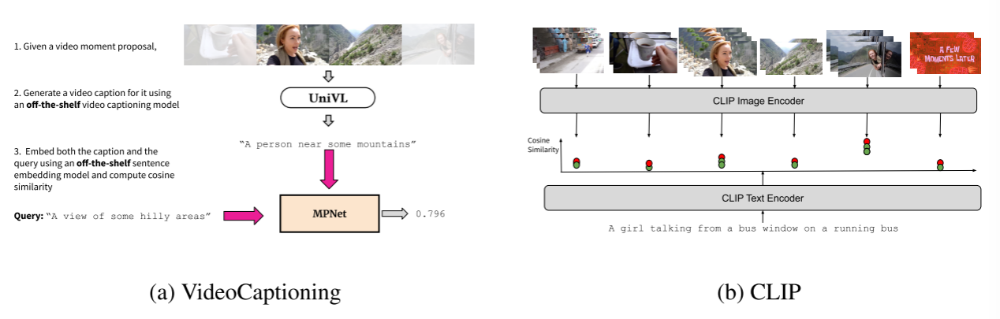
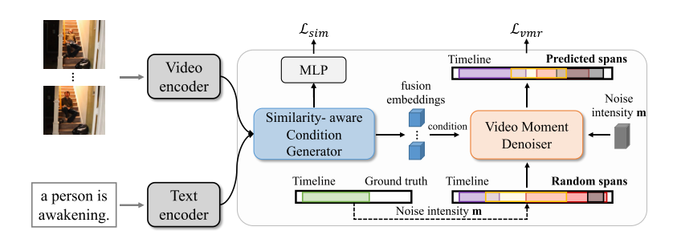
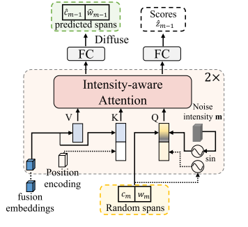

# 视频检索文献阅读

1. Overcoming Weak Visual-Textual Alignment for Video Moment Retrieval   通过增加一个负样本的输入增加检索信息，使用transeformer同时计算负样本和正样本输入与查询片段匹配的概率

2. LLaViLo: Boosting Video Moment Retrieval via Adapter-Based Multimodal Modeling 通过微调llm模型实现

3. Moment Detection in Long Tutorial Videos 提出了两个长教学视频数据集，结合两个模型，提出了一个LONGMOMENT-DETR框架。对于视频特征，文章采用了SlowFast网络提取的视频理解特征，这些特征每8秒提取一次。对于文本特征，文章使用了GPT2-xl模型提取的特征，这篇文章主要应该是数据集贡献，运用了很多成熟的模型如gpt3，最后拼接了一个自己的模型。文章指出了其方法的局限性，包括依赖自动注释生成可能导致的文本幻觉或错误的片段时间标记问题

4. Diversifying Query: Region-Guided Transformer for Temporal Sentence Grounding提出了两个模块，Region-Guided Decoder，通过给视频分段，静态锚点标记视频的不同时刻，动态锚点标记长度，每一对锚点负责特定时间区域的时刻预测。IoU-Aware Scoring Head，比较所有锚框找出和ground truth的Iou最大，有点类似yolo。这个论文目的是为了消除重叠和冗余的预测。
**模型总架构**

**Region-Guided Decoder图**
#  无监督方法

5. Zero-shot Video Moment Retrieval With Off-the-Shelf Models 零样本方法 论文提出的方法分三步：生成时刻提案、执行时刻-查询匹配和后处理。这些步骤使用了现成的模型，第一步，简单的镜头转换检测器：通过镜头转换检测器将视频分成连续不相交的片段。第二步，CLIP模型和视频描述模型UniVL，对每个片段和Query进行相似度评分，选最大。后处理简化版的Watershed算法，将连续的超过相似度阈值的片段连在一起。未来的改进方法：改进clip（提高帧率）或者使用其他更好的视频文本模型VideoCLIP，镜头转换器的选择
**总流程图**

**第二步流程**

## 有监督扩散

6. MomentDiff: Generative Video Moment Retrieval from Random to Real 研究目的：这些方法存在大量冗余的候选框，并且正负候选框的数量不平衡，这限制了学习效率.方法：使用clip处理编码视频输入，Glove和CLIP处理文本输入，**Similarity-aware Condition Generator**使用多层transformer和MLP评估文本和视频相似度，生成一个文本视频融合矩阵，视频嵌入 V被映射为查询 Qv，文本嵌入 T被映射为键 Kt和值 Vt。**Video Moment Denoiser**将真实片段转化为有噪声的数据，**Intensity-aware attention**主要包括两层交叉注意力的 Transformer 层，用于反向去噪，VMD 模型与传统的去噪模型不同，它不直接预测均值 μθ(xm,m)，而是通过网络 fθ(xm,m,F) 预测“跨度”参数   **局限性：**需要多次迭代

   **总体架构**

​    **VMD架构**

# 半监督

1. Weakly Supervised Video Moment Localization with Contrastive Negative Sample Mining 使用高斯掩码正负样本提议，使模型能区分高度混淆的场景
2. Weakly Supervised Temporal Sentence Grounding with Gaussian-based Contrastive Proposal Learning  使用多个可学习的高斯函数在同一视频内生成正负提案，从易到难的负样本挖掘 局限性：复杂查询
3. Scene Complexity Aware Network for Weakly-Supervised Video Moment Retrieval  解决现有方法中场景与提案不匹配的问题 SCANet 包含场景复杂度估计、输入表示、复杂度自适应提案生成（CPG）和复杂度自适应提案增强（CPE）四个主要部分。首先估计视频的场景复杂度，然后根据复杂度生成和增强提案，最后通过对比学习和动态校准损失优化网络。 局限性：对于一些不常见动作的查询可能预测错误，下一步研究方向：场景复杂度神经估计器
4. Counterfactual Cross-modality Reasoning for Weakly Supervised Video Moment Localization 解决因掩码查询与重建之间的虚假相关性导致的对比学习不合理问题。主副分支，消除单模态未掩码查询对重建的影响。这个文章还指出了单纯用视频还原查询，有太多冗余信息，掩码查询充当了注意力角色
5. Atomic-action-based Contrastive Network for Weakly Supervised Temporal Language Grounding 利用 k - means 算法将所有视频帧特征自适应地分组。由于视频帧特征在时间上的变化通常是平滑的，当出现视觉特征空间的突变时，认为附近的帧属于不同的原子动作，因此将这些突变点作为动作边界集合，这等于为无监督方法提供了又一种信息来源，为了去除与查询不相关的动作，模型提出了区分性词策略，区分性词能够突出查询中与动作相关的关键语义，减少与相似背景动作的不匹配，从而更好地指导模型定位与查询相关的事件。